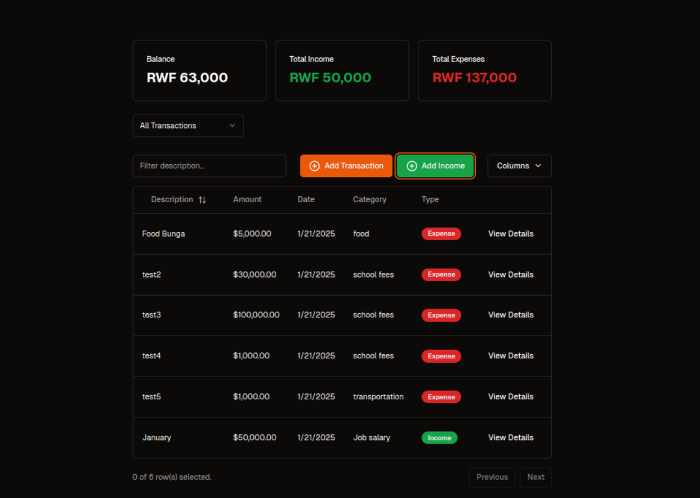

# Wallet Web Application

<div align="center">
  <h1>Personal Finance Management Application</h1>
  <p>Track expenses, monitor budgets, and visualize spending patterns across multiple accounts.</p>

  <a href="https://wallet-app-pro.vercel.app/">Live Demo</a>
</div>

## Overview

*Track multiple accounts in one place*


*Manage and categorize your transactions*



## Demo Access

Try out the application using these demo credentials:

```bash
Email: eric.test@gmail.com
Password: 123
```

**Note:** This is a demo account with sample data. For security reasons, please use your own credentials in production.

## Key Features

- 📊 **Multi-Account Management** - Track bank, mobile money, and cash accounts
- 📈 **Dynamic Reports** - Generate custom reports for any time period
- 💰 **Budget Tracking** - Set and monitor spending limits
- 🏷️ **Smart Categorization** - Organize transactions with categories and subcategories
- 📱 **Responsive Design** - Works seamlessly on desktop and mobile
- 📊 **Visual Analytics** - Beautiful charts and spending breakdowns

## Tech Stack

- **Framework:** Next.js 14, React
- **Styling:** Tailwind CSS
- **Database:** PostgreSQL
- **Authentication:** NextAuth.js
- **Deployment:** Vercel

## Database Schema

### Users
```sql
CREATE TABLE users (
    id SERIAL PRIMARY KEY,
    name VARCHAR(100) NOT NULL,
    email VARCHAR(150) UNIQUE NOT NULL,
    password_hash TEXT NOT NULL,
    created_at TIMESTAMP DEFAULT NOW(),
    updated_at TIMESTAMP DEFAULT NOW()
);
```

### Accounts
```sql
CREATE TABLE accounts (
    id SERIAL PRIMARY KEY,
    user_id INT REFERENCES users(id) ON DELETE CASCADE,
    name VARCHAR(100) NOT NULL,
    balance DECIMAL(15, 2) DEFAULT 0.00,
    account_type VARCHAR(50),
    amount_limit DECIMAL(15, 2) NOT NULL,
    start_date DATE NOT NULL,
    end_date DATE NOT NULL,
    is_active BOOLEAN DEFAULT TRUE,
    created_at TIMESTAMP DEFAULT NOW(),
    updated_at TIMESTAMP DEFAULT NOW()
);
```

### Categories
```sql
CREATE TABLE categories (
    id SERIAL PRIMARY KEY,
    user_id INT REFERENCES users(id) ON DELETE CASCADE,
    name VARCHAR(100) NOT NULL,
    parent_id INT REFERENCES categories(id) ON DELETE SET NULL,
    user_id INT REFERENCES users(id) ON DELETE SET NULL,
    created_at TIMESTAMP DEFAULT NOW(),
    updated_at TIMESTAMP DEFAULT NOW()
);
```

### Transactions
```sql
CREATE TABLE transactions (
    id SERIAL PRIMARY KEY,
    user_id INT REFERENCES users(id) ON DELETE CASCADE,
    account_id INT REFERENCES accounts(id) ON DELETE CASCADE,
    category_id INT REFERENCES categories(id) ON DELETE SET NULL,
    amount DECIMAL(15, 2) NOT NULL,
    transaction_date TIMESTAMP DEFAULT NOW(),
    description TEXT,
    created_at TIMESTAMP DEFAULT NOW(),
    updated_at TIMESTAMP DEFAULT NOW()
);
```

## Quick Start

1. Clone the repository
```bash
git clone [REPO_URL]
```

2. Install dependencies
```bash
npm install
```

3. Configure environment variables
```bash
cp .env.example .env.local
```

4. Start the development server
```bash
npm run dev
```

## Live Demo

Check out the live demo at [DEPLOYMENT_URL]

## Contributing

Contributions are welcome! Please feel free to submit a Pull Request.

## License

This project is licensed under the MIT License - see the [LICENSE](LICENSE) file for details.

## Acknowledgments

- Thanks to Code of Africa GmbH for the project requirements
- Built with [Next.js](https://nextjs.org/)
- Hosted on [Vercel](https://vercel.com)
